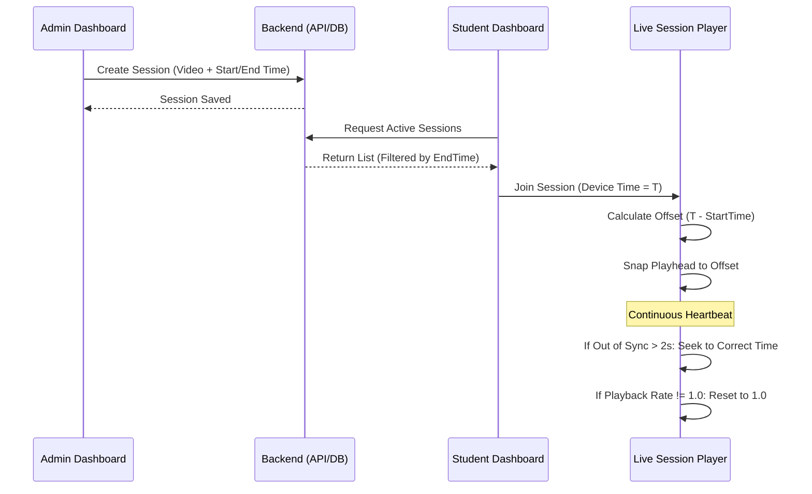

# Live Session Feature Documentation

The Live Session feature allows instructors to schedule and "broadcast" pre-recorded videos as live events, ensuring all students watch the content simultaneously without the ability to skip or speed up.

## 🏗️ Backend Architecture

### 1. Data Model (`LiveSession.cs`)
The core entity represents a scheduled session:
- **`Title` & `Description`**: Metadata for the session.
- **`VideoUrl`**: The source of the broadcast.
- **`StartTime` & `EndTime`**: Define the live window.
- **`CourseId`**: Optional association with a specific course.

### 2. API Controller (`LiveSessionsController.cs`)
- **`GET /api/LiveSessions`**: Retrieves upcoming and current sessions (where `EndTime > now`). It automatically filters out expired content to keep the dashboard clean.
- **`POST /api/LiveSessions`**: Admin-only. Supports dual-input:
    - **Binary Upload**: Uses `IFileUploadService` for direct video ingestion.
    - **Cloud URL**: Supports external cloud storage links.
- **`PUT /api/LiveSessions/{id}`**: Admin-only update logic.
- **`DELETE /api/LiveSessions/{id}`**: Removes the session and associated files.

### 3. Virtual Playhead Logic
The backend doesn't "stream" in the traditional sense. It calculates a virtual playhead based on the `StartTime`. This ensures minimal server load while achieving a broadcast-like experience.

---

## 💻 Frontend Implementation

### 1. Discovery (`LiveSessionsPage.jsx`)
Students can browse all upcoming sessions. The UI dynamically detects the session status by comparing `now` with the session window. "Live Now" badges highlight active broadcasts.

### 2. Synchronization Player (`LiveSessionPlayer.jsx`)
The player is engineered to maintain a "Shared Experience" using a strict synchronization algorithm:

#### The Live Sync Algorithm
Every student is anchored to the global live timestamp:
```javascript
const expectedTime = (new Date() - normalizeDate(session.startTime)) / 1000;
```
If a student joins late, the player "snaps" to this calculated time, ensuring everyone sees the same frame.

#### Anti-Skip Enforcement
To protect the integrity of the live event, three layers of protection are active:
- **Seek Snapping**: Any attempt to scrub the progress bar triggers an `onSeeking` event that resets the video to the `expectedTime`.
- **Forward-Guard**: The `onTimeUpdate` handler prevents "skipping ahead" via player hacks.
- **Speed Lock**: The `onRateChange` handler instantly resets the playback rate to `1.0x` if a student attempts to speed up the video.

### 3. Admin Management (`LiveSessionManager.jsx`)
A dedicated dashboard for administrators to schedule sessions with precise date-time pickers and drag-and-drop video uploads.

---

## 🔄 Operational Workflow

### Visual Sequence Diagram


### Step-by-Step Breakdown
Admins define a "Live Window" (Start/End) and provide a video asset. The system stores these timestamps in the database without requiring a dedicated streaming server.

### 2. Discovery & Filtering
The frontend retrieves sessions and compares the `session.startTime` with the current device time. The "Join" button only activates when the window is open.

### 3. Initial Handshake (The Join)
Upon joining, the player calculates the offset: `(Now - StartTime)`. The video instantly snaps to this timestamp, ensuring late-joiners are automatically synchronized.

### 4. Ongoing Heartbeat
An internal timer re-calculates the sync every second. If a student's connection lags, the player forced-snaps them forward to the global live point.

### 5. Anti-Cheat Enforcement
- **Seek Protection**: Any attempt to scrub the bar triggers an immediate reset to the live timestamp.
- **Speed Locking**: Attempts to play at 1.5x or 2x are instantly reverted to 1.0x via the `onRateChange` listener.

### 6. Auto-Termination
Once the `EndTime` passes, the API stops returning the session, and the live broadcast effectively concludes.

---

## 🔒 Security & Roles
- **Students**: Read-only access to session lists and synchronized playback.
- **Admins**: Full CRUD permissions enforced via JWT Role-based Authorization in the backend.
